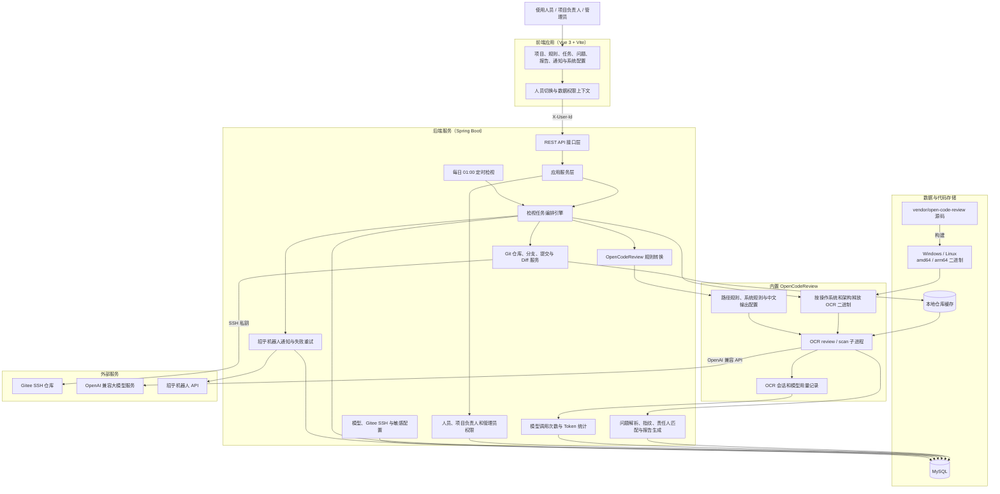

# Code Review 项目说明

代码评审管理平台，后端基于 Spring Boot，前端基于 Vue 3 + Vite，代码检视引擎使用 [alibaba/open-code-review](https://github.com/alibaba/open-code-review)。

## 系统架构



核心检视链路为：任务创建后准备仓库和检视范围，生成同一份 Git Diff，加载启用的路径规则并启动内置 OCR；OCR 调用当前启用的 OpenAI 兼容模型，将 JSON 结果返回平台。平台随后完成问题落库、Git 提交人匹配、报告生成、模型用量统计，并按任务通知选项向相关人员发送招乎机器人消息。

## 环境要求

- JDK 17
- Maven 3.6+
- Node.js 18+
- npm
- MySQL 8+
- Git 2.41+

OpenCodeReview v1.7.9 源码位于 `vendor/open-code-review`，Windows/Linux 的 amd64、arm64 二进制均随项目打包。Spring Boot 启动时根据 `os.name`、`os.arch` 自动选择对应版本，校验 SHA-256 后释放到系统临时目录并调用，因此不需要安装 npm 包、Go 环境或全局 `ocr` 命令。

项目管理中的“触发检视”与 OCR v1.7.9 对齐，支持四种方式：分支区间（`review --from <base> --to <head>`）、单个提交（`review --commit <ref>`）、工作区（`review`）和全量扫描（`scan`）。全量扫描可设置路径、排除模式、Token 预算和跳过规划；所有方式都支持传入业务背景。引擎统一使用 JSON agent 输出，并把 `comments` 写入平台问题列表。平台模型配置会通过 `OCR_LLM_URL`、`OCR_LLM_TOKEN`、`OCR_LLM_MODEL` 传给子进程，不需要单独执行 `ocr config provider`。

平台会为内置 OCR 创建独立运行目录，并把 OCR 的 `language` 固定配置为 `Chinese`，确保分析过程、问题说明和修复建议使用中文输出，不依赖服务器上的全局 OCR 配置。

问题严重度与 OCR 保持一致，仅使用 `critical`、`high`、`medium`、`low` 四级，平台分别展示为“严重”“高”“中”“低”。数据库中使用对应的大写值 `CRITICAL`、`HIGH`、`MEDIUM`、`LOW`。

平台每天按北京时间 `01:00` 遍历所有启用项目，为每个项目的默认分支分别创建一条定时检视任务。任务只选择昨天 `00:00:00` 至今天 `00:00:00` 之间提交的代码交给 OCR；即使没有提交，也会保留一条提交数、文件数和问题数均为 0 的成功任务结果。任务详情与报告会记录检视分支和提交时间范围。

手动检视会先从所选项目和分支读取最近 100 条 Git 提交，提交选择项包含短哈希、提交说明、作者和提交时间。分支区间检视默认将结束版本设为仓库最新提交、起始版本设为上一条提交；单提交检视默认选择最新提交。

手动检视还支持“昨天提交”方式，按北京时间读取昨天 `00:00:00` 至今天 `00:00:00` 的提交并调用 OCR，执行范围与每日定时检视一致。该方式可选择是否发送机器人通知；启用后，问题会按 Git 提交人匹配系统人员并分组发送，项目负责人收到项目全部问题。

平台内置人员切换功能，请求通过 `X-User-Id` 标识当前人员。项目可配置多个负责人；负责人能够查看项目下的全部问题，其他人员只能查看分配给自己的问题。检视完成后平台通过 `git blame` 获取问题行对应的提交人，并使用提交人姓名或工号匹配系统人员，例如提交人 `何国庆IT011826` 会自动分配给何国庆。未匹配到人员的问题仅项目负责人可见。

人员列表包含“管理员（ADMIN）”。右上角切换为管理员后不应用人员和项目负责人范围过滤，可以查看全部项目、任务、问题、首页统计和通知内容。

项目管理支持 `.xlsx` 批量导入，模板字段依次为：项目名称、仓库地址、项目类型（前端/后端）、检视分支、负责人名字。检视分支为空时默认使用 `dev`；多个负责人使用中文或英文逗号分隔，导入时会按姓名匹配系统人员并保存用户 ID，无法匹配的负责人会作为该行导入失败原因返回。

模型配置支持“招行内部大模型”渠道。该渠道只需填写模型名称和 API Key，平台会自动生成 OpenAI 兼容地址 `http://open-llm.uat.cmbchina.cn/llm/{model}/v1/chat/completions`，并使用 `Authorization: Bearer {apiKey}` 调用。部署到其他环境时可通过 `CMB_INTERNAL_LLM_BASE_URL` 覆盖 `http://open-llm.uat.cmbchina.cn/llm`。

每天的定时检视任务结束后，平台默认通过招乎机器人发送自定义卡片，卡片包含项目名称、检视分支、任务状态、个人相关问题和问题链接。通知配置页面只保留招乎机器人渠道，可维护 API 地址、Client ID、Client Secret、机器人 ID、平台访问地址、Token 缓存和请求超时；也可使用同名的 `ZHAOHU_*` 环境变量或敏感 SQL 初始化。OAuth Token 在内存中缓存并提前刷新，失败消息最多自动重试 3 次。

迁移环境时可复制 `scripts/sensitive-config.example.sql` 为 `scripts/sensitive-config.local.sql`，填入 Gitee SSH 私钥、模型 API Key 和招乎机器人凭据后执行。`sensitive-config.local.sql` 已加入 `.gitignore`，不会被 Git 跟踪；其中的招乎配置优先于环境变量。

招乎通知按人员分别发送：问题责任人只收到分配给自己的问题，项目负责人收到项目全部问题；没有相关问题且不是项目负责人的人员不会收到该项目通知。接收方 `toId` 使用系统人员的 `userId`，消息链接为 `/issues?taskId={taskId}&userId={userId}`，打开后平台会自动切换到对应人员。通知配置页面提供发送测试、配置维护和招乎投递日志查询；旧 Webhook 渠道及通知模板功能已移除。

原有的 AI Skill、Python 脚本规则和平台内置 AI diff 分块执行链路已停用。检视规则现在直接对应 OpenCodeReview 的 `path`、`rule` 和 `merge_system_rule`。

## 数据库配置

开发环境默认使用 `dev` profile，数据库连接配置位于 `src/main/resources/application-dev.yml`。

默认连接信息：

```text
host: 127.0.0.1
port: 3306
database: code_review
username: root
password: 1234
```

如需覆盖默认值，可在启动后端前设置环境变量：

```powershell
$env:CODE_REVIEW_DB_HOST = "127.0.0.1"
$env:CODE_REVIEW_DB_PORT = "3306"
$env:CODE_REVIEW_DB_NAME = "code_review"
$env:CODE_REVIEW_DB_USERNAME = "root"
$env:CODE_REVIEW_DB_PASSWORD = "1234"
```

初始化脚本位于 `src/main/resources/db/init.sql`。

Gitee 仓库统一通过 SSH 私钥访问，不再使用 Token。可在“系统配置”中维护 Gitee 地址和私钥，也可使用环境变量：

```powershell
$env:CODE_REVIEW_GITEE_BASE_URL = "https://gitee.com"
$env:CODE_REVIEW_GITEE_SSH_PRIVATE_KEY = Get-Content "$HOME\.ssh\id_ed25519" -Raw
```

项目仓库地址支持完整 HTTPS/SSH 地址，也支持 `组织/仓库.git` 相对地址；平台会按配置的 Gitee 地址转换为 SSH 地址。运行时私钥释放到当前用户的 `~/.code-review/ssh/gitee_key`，Git 使用 `IdentitiesOnly` 和非交互模式访问仓库。

OpenCodeReview 可选配置：

```powershell
# 仅在需要覆盖项目内置 OCR 时配置
$env:CODE_REVIEW_OCR_COMMAND = "C:\tools\ocr.exe"
$env:CODE_REVIEW_OCR_EXTRACT_ROOT = "C:\code-review-runtime\ocr"
$env:CODE_REVIEW_OCR_CONCURRENCY = "4"
$env:CODE_REVIEW_OCR_TIMEOUT_MINUTES = "10"
$env:CODE_REVIEW_OCR_PROCESS_TIMEOUT_MINUTES = "15"
```

## 构建内置 OpenCodeReview

普通启动不需要 Go。只有升级 OCR 源码或生成其他操作系统的内置二进制时，才需要安装 Go 1.25.5 或更高版本。

Windows PowerShell：

```powershell
.\scripts\build-ocr.ps1 -TargetOs windows -TargetArch amd64
```

Linux/macOS：

```bash
./scripts/build-ocr.sh linux amd64
./scripts/build-ocr.sh linux arm64
./scripts/build-ocr.sh darwin arm64
```

脚本从 `vendor/open-code-review` 编译，并将压缩二进制及 SHA-256 文件写入 `src/main/resources/ocr/<os>-<arch>`。当前仓库已包含 `windows-amd64`、`windows-arm64`、`linux-amd64`、`linux-arm64` 四个平台资源；升级 OCR 源码后需要重新生成这些资源。

## 启动后端

在项目根目录执行：

```powershell
mvn spring-boot:run
```

后端默认端口：

```text
http://localhost:8080
```

Swagger 地址：

```text
http://localhost:8080/swagger-ui.html
```

健康检查：

```powershell
Invoke-RestMethod -Method Post `
  -Uri "http://localhost:8080/api/health/check" `
  -ContentType "application/json" `
  -Body "{}"
```

正常返回示例：

```json
{
  "code": "0",
  "message": "success",
  "data": {
    "status": "UP"
  }
}
```

## 启动前端

进入前端目录：

```powershell
cd frontend
```

首次启动前安装依赖：

```powershell
npm install
```

启动开发服务：

```powershell
npm run dev
```

前端默认端口：

```text
http://localhost:5173
```

前端开发服务已在 `frontend/vite.config.ts` 中配置代理，所有 `/api` 请求会转发到：

```text
http://localhost:8080
```

可通过前端代理验证后端连通性：

```powershell
Invoke-RestMethod -Method Post `
  -Uri "http://localhost:5173/api/health/check" `
  -ContentType "application/json" `
  -Body "{}"
```

## 常见问题

查看端口占用：

```powershell
Get-NetTCPConnection -LocalPort 8080,5173 -ErrorAction SilentlyContinue |
  Select-Object LocalAddress,LocalPort,State,OwningProcess
```

根据进程 ID 查看进程：

```powershell
Get-Process -Id <PID>
```

停止占用端口的进程：

```powershell
Stop-Process -Id <PID>
```
